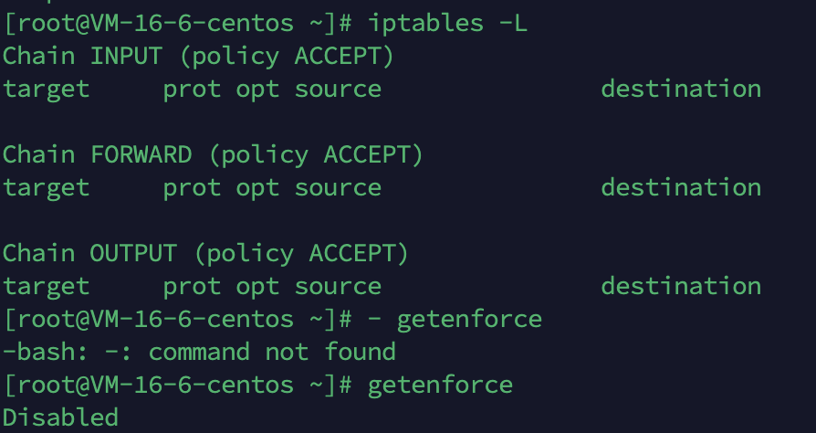
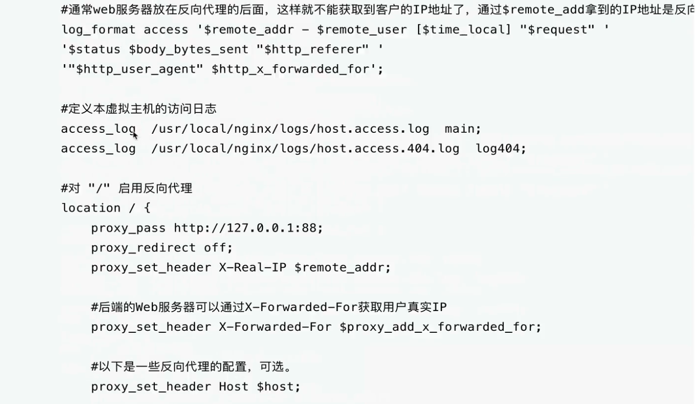

# Nginx

## 内核空间


## 下载安装
1. yum源
- 步骤1 确认有wget命令
  - 如果没有的话需要安装：
  - yum install wget
- 步骤2： 备份旧的yum源
  - mkdir /etc/yum.repos.d/repobak
  - mv /etc/yum.repos.d/* /etc/yum.repos.d/repobak
    >如上的操作，就是使得在yum仓库的一层目录，没有任何repo文件，因此就实现了linux此时没有yum源了，此时没有yum源 就需要再配置一个新的repo仓库文件
  - 可以访问阿里云的镜像站
  - https://developer.aliyun.com/mirror/
  - 用如下命令生成新的yum源
    - wget -O /etc/yum.repos.d/CentOS-Base.repo https://mirrors.aliyun.com/repo/Centos-7.repo
    - wget -O /etc/yum.repos.d/epel.repo https://mirrors.aliyun.com/repo/epel-7.repo
- 步骤3 清空和生成yum缓存 
  - 清空旧的yum缓存
    - yum clean all
  - 生成新的aliyun的yum缓存，加速下次下载
    - yum makecache
2. 安装编译依赖工具

- yum install -y gcc gcc-c++ autoconf automake make

3. 安装使用nginx还得安装nginx所需的一些第三方系统库的支持，比如nginx的静态资源压缩功能所需的gzip lib库，nginx需要支持URL重写，所学的pcre库，perl开发的依赖库，以及nginx搭建加密站点https所需的openssl依赖库等
- yum install zlib zlib-devel openssl openssl-devel pcre pcre-devel wget httpd-tools vim

4. 安装完nginx所需的基础依赖库，需检查系统的防火墙是否关闭，selinux yum配置、网络情况等
- iptables -L
- getenforce
  

5. 编译安装nginx
- 下载程序源代码(nginx.org)
  - wget https://nginx.org/download/nginx-1.25.0.tar.gz
- 解压缩
  - tar -zxvf nginx-1.25.0.tar.gz
- 进入目录
  - cd /opt/nginx-1.25.0
```
[root@VM-16-6-centos nginx-1.25.0]# ll
total 836
drwxr-xr-x 6 1001 1001   4096 Jun 10 20:49 auto  检测系统模块依赖信息
-rw-r--r-- 1 1001 1001 323328 May 23 23:08 CHANGES 存放nginx的变化记录日志
-rw-r--r-- 1 1001 1001 494278 May 23 23:08 CHANGES.ru
drwxr-xr-x 2 1001 1001   4096 Jun 10 20:49 conf  存放nginx主配置文件的目录
-rwxr-xr-x 1 1001 1001   2611 May 23 23:08 configure  可执行的脚本，用于释放编译文件的定制脚本
drwxr-xr-x 4 1001 1001   4096 Jun 10 20:49 contrib 提供了vim插件，让配置文件颜色区分，更友好
drwxr-xr-x 2 1001 1001   4096 Jun 10 20:49 html  存放了标准的html页面文件
-rw-r--r-- 1 1001 1001   1397 May 23 23:08 LICENSE
drwxr-xr-x 2 1001 1001   4096 Jun 10 20:49 man
-rw-r--r-- 1 1001 1001     49 May 23 23:08 README
drwxr-xr-x 9 1001 1001   4096 Jun 10 20:49 src  存放了nginx源代码的目录
```
- 进入软件源代码目录，执行编译脚本文件，如 制定安装路径以及开启额外功能等
  - cd /opt/nginx-1.25.0
  - 查看编译脚本的信息
  - ./configure --help
- 执行编译脚本文件，释放makefile等信息
  - ./configure --prefix=/opt/nginx --with-http_ssl_module  --with-http_flv_module --with-http_gzip_static_module --with-http_stub_status_module --with-threads --with-file-aio
- 执行make指令
- 开始安装
  - make install
- 查看安装后的文件夹
  - conf  html  logs  sbin
  ```
  conf 存放nginx的配置文件  如 nginx.conf
  html存放nginx的网页根目录文件，存放站点的静态文件数据
  logs 存放nginx的各种日志文件
  sbin 存放该软件的可执行文件
  ```
- 配置path变量
  - 创建一个脚本文件
    - cd /etc/profile.d/
    - vim nginx.sh
    ```
    export PATH="$PATH:/opt/nginx/sbin/"
    ```
    - 需要重新加载新加的配置文件（笨办法 reboot 重启系统）
- 启动nginx服务
  - nginx
- 重启nginx服务
  - 停止服务，断掉所有使用用户
  - nginx -s stop
  - 不重启，加载配置文件
  - nginx -s reload
- 检查nginx版本
  - nginx -V
6. 拷贝nginx的配置文件语法高亮，发给vim的插件目录
- mkdir -p ~/.vim
- cp -r /opt/nginx-1.25.0/contrib/vim/* ~/.vim/
### 配置文件语法
- nginx.conf是由指令和指令块组成
- 每行语句都得有分好结束,指令和参数之间是由空格分割的
- 指令块可以由大括号{}组织多条语句
- nginx.conf使用#号表示注释符
- nginx支持用$变量名 支持该语法
- nginx支持include语句,组合多个配置文件
- nginx部分指令支持正则表达式,如rewite重写指令

## nginx.conf指令注释
######Nginx配置文件nginx.conf中文详解####
```
#定义Nginx运行的用户和用户组
user www www;

# nginx进程数,建议设置为等于CPU总核数
worker_processes 8;

#全局错误日志定义类型，[debug | info | notice | warn | error | crit]
error_log /usr/local/nginx/logs/error.log info;

#进程pid文件
pid /usr/local/nginx/logs/nginx.pid

#制定进程可以打开的最大描述符：数目
#工作模式与链接数上线
#这个失灵是指当一个nginx进程打开的最多文件描述符数目，理论值应该是最多打开文件数（ulimit -n）与nginx进程数
worker_rlimit_nofile 65535;

events{
    #参考时间木星，use[ kqueue | rtsig | epoll | /dev/poll | select | poll ]; epoll模型
    #是Linux 2.6 以上版本内核中的高性能网络I/O模型，linux建议epoll，如果泡在FreeBSD上面，就用kqueue模型。
    #补充说明：
    #与apache相似，nginx针对不同的操作系统，有不同的事件类型
    #A) 标准事件模型
    # Select、poll属于标准事件模型，如果当前系统不存在更有效的方法，nginx会选择select或poll
    #B) 高效事件模型
    #Kqueue：使用FreeBSD 4.1+，OpenBSD 2.9+，NetBSD 2.0 和MacOS X。 使用双处理器的MacOS X系统使用
    #Eventport：使用与Solaris 10. 为了防止
}
```





- 可以在配置文件最后的部分增加如下配置，表示加载了extra文件夹下面的所有以conf结尾的配置文件
  - include extra/*.conf 


https

## 配置
